# PlayerOne Frontend Architecture

## Overview

PlayerOne is a gamified productivity application built with React, featuring a comprehensive task management system, inventory management, shop functionality, and a sophisticated theming system. The frontend is designed with modularity, reusability, and maintainability in mind.

## Tech Stack

- **Framework**: React 18.3.1 with Vite
- **Routing**: React Router DOM 7.1.5
- **Styling**: Tailwind CSS 4.0.3 with custom theme system
- **Animations**: Framer Motion 12.0.6
- **Drag & Drop**: @dnd-kit (core, sortable, utilities)
- **Icons**: Heroicons React 1.0.6
- **State Management**: React Context API
 
## Project Structure

```
frontend/
├── src/
│   ├── components/           # Reusable UI components
│   │   ├── common/          # Shared components (Header, Footer)
│   │   ├── habits/          # Habit-related components
│   │   ├── tasks/           # Task-related components
│   │   ├── projects/        # Project-related components
│   │   ├── inventory/       # Inventory management components
│   │   ├── shop/            # Shop functionality components
│   │   ├── modals/          # Modal components
│   │   ├── dnd/             # Drag and drop components
│   │   ├── shared/          # Shared item components
│   │   ├── ui/              # UI utility components
│   │   └── layout/          # Layout components
│   ├── context/             # React Context providers
│   ├── pages/               # Page components
│   ├── services/            # API services
│   ├── styles/              # Styling system
│   ├── utils/               # Utility functions
│   ├── data/                # Mock data
│   └── assets/              # Static assets
├── public/                  # Public assets
└── package.json
```

## Architecture Diagram

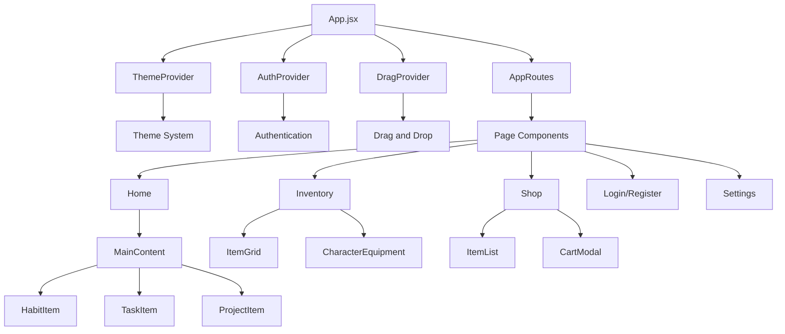
```mermaid
graph TB
    A[App.jsx] --> B[ThemeProvider]
    A --> C[AuthProvider]
    A --> D[DragProvider]
    A --> E[AppRoutes]
    
    B --> F[Theme System]
    C --> G[Authentication]
    D --> H[Drag and Drop]
    E --> I[Page Components]
    
    I --> J[Home]
    I --> K[Inventory]
    I --> L[Shop]
    I --> M[Login/Register]
    I --> N[Settings]
    
    J --> O[MainContent]
    O --> P[HabitItem]
    O --> Q[TaskItem]
    O --> R[ProjectItem]
    
    K --> S[ItemGrid]
    K --> T[CharacterEquipment]
    
    L --> U[ItemList]
    L --> V[CartModal]
```

## Core Context Providers

### 1. ThemeProvider
Manages the application's theming system with multiple theme variants.

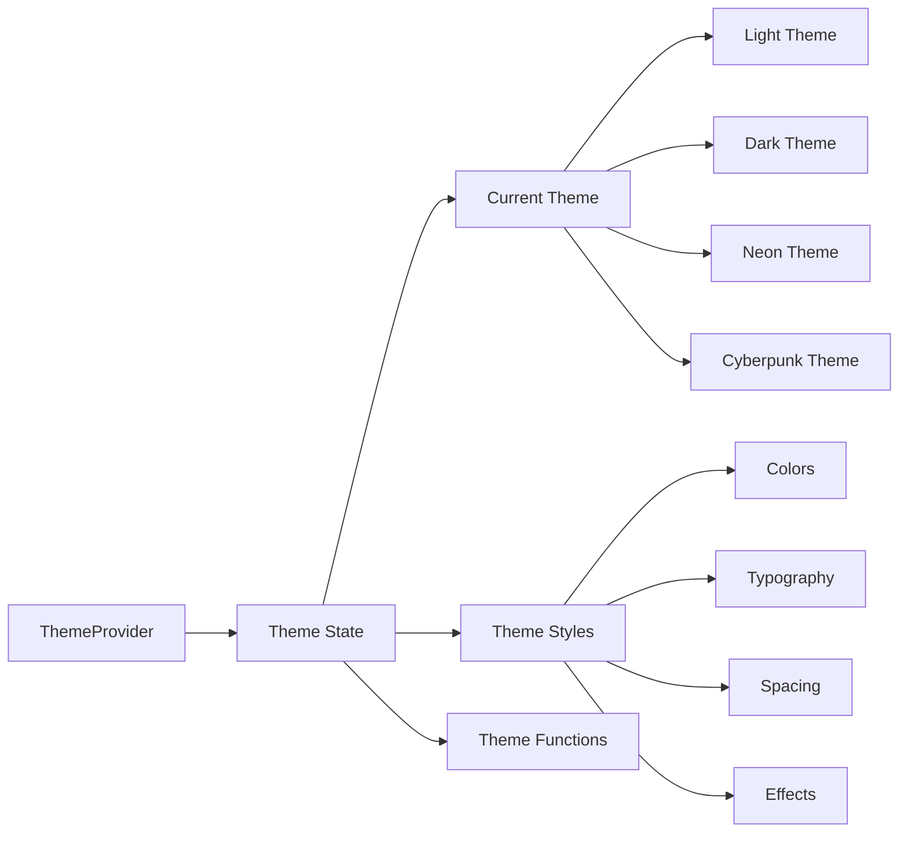
```mermaid
graph LR
    A[ThemeProvider] --> B[Theme State]
    B --> C[Current Theme]
    B --> D[Theme Styles]
    B --> E[Theme Functions]
    
    C --> F[Light Theme]
    C --> G[Dark Theme]
    C --> H[Neon Theme]
    C --> I[Cyberpunk Theme]
    
    D --> J[Colors]
    D --> K[Typography]
    D --> L[Spacing]
    D --> M[Effects]
```

**Key Features:**
- Multiple theme variants (Light, Dark, Neon, Cyberpunk)
- Dynamic theme switching
- Custom styling functions
- Theme-aware component styling

### 2. AuthProvider
Handles user authentication and session management.

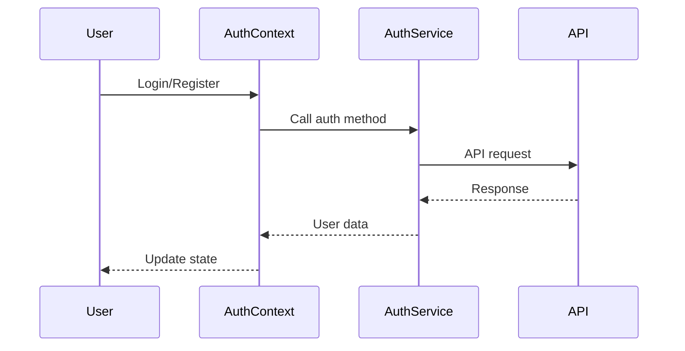
```mermaid
sequenceDiagram
    participant U as User
    participant C as AuthContext
    participant S as AuthService
    participant A as API
    
    U->>C: Login/Register
    C->>S: Call auth method
    S->>A: API request
    A-->>S: Response
    S-->>C: User data
    C-->>U: Update state
```

**Key Features:**
- User registration and login
- JWT token management
- Session persistence
- Protected route handling

### 3. DragProvider
Manages drag and drop functionality across the application.

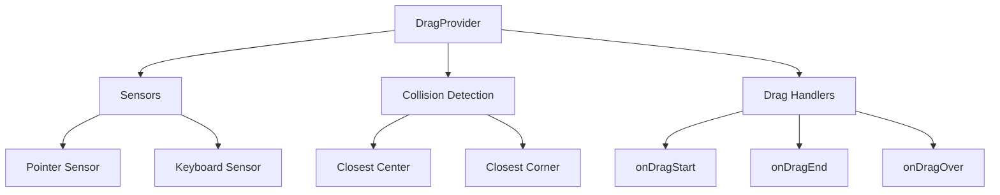
```mermaid
graph TD
    A[DragProvider] --> B[Sensors]
    A --> C[Collision Detection]
    A --> D[Drag Handlers]
    
    B --> E[Pointer Sensor]
    B --> F[Keyboard Sensor]
    
    C --> G[Closest Center]
    C --> H[Closest Corner]
    
    D --> I[onDragStart]
    D --> J[onDragEnd]
    D --> K[onDragOver]
```

## Component Architecture

### Page Components

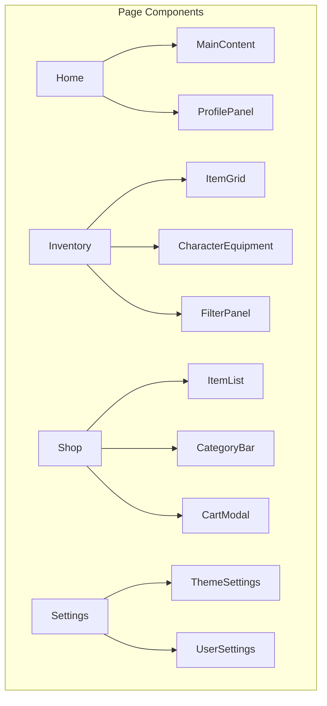
```mermaid
graph TB
    subgraph "Page Components"
        A[Home] --> B[MainContent]
        A --> C[ProfilePanel]
        
        D[Inventory] --> E[ItemGrid]
        D --> F[CharacterEquipment]
        D --> G[FilterPanel]
        
        H[Shop] --> I[ItemList]
        H --> J[CategoryBar]
        H --> K[CartModal]
        
        L[Settings] --> M[ThemeSettings]
        L --> N[UserSettings]
    end
```

### Component Hierarchy

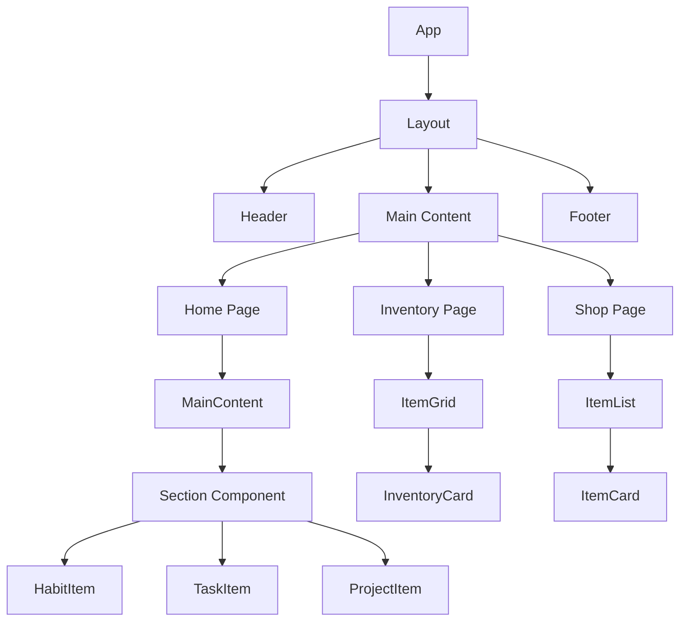
```mermaid
graph TD
    A[App] --> B[Layout]
    B --> C[Header]
    B --> D[Main Content]
    B --> E[Footer]
    
    D --> F[Home Page]
    F --> G[MainContent]
    G --> H[Section Component]
    H --> I[HabitItem]
    H --> J[TaskItem]
    H --> K[ProjectItem]
    
    D --> L[Inventory Page]
    L --> M[ItemGrid]
    M --> N[InventoryCard]
    
    D --> O[Shop Page]
    O --> P[ItemList]
    P --> Q[ItemCard]
```

## Key Components Breakdown

### 1. MainContent Component
The central component for the home page that manages habits, tasks, and projects.

**Features:**
- Drag and drop reordering
- Tab-based filtering
- Search functionality
- Add new items
- Edit existing items

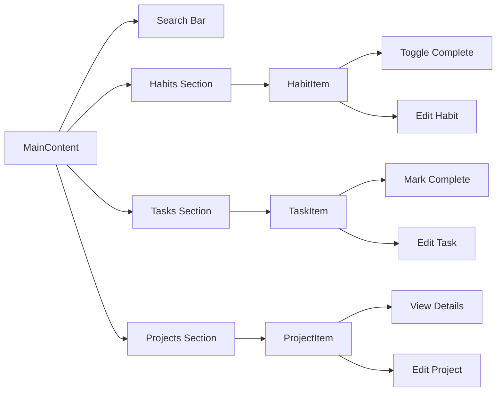
```mermaid
graph LR
    A[MainContent] --> B[Search Bar]
    A --> C[Habits Section]
    A --> D[Tasks Section]
    A --> E[Projects Section]
    
    C --> F[HabitItem]
    D --> G[TaskItem]
    E --> H[ProjectItem]
    
    F --> I[Toggle Complete]
    F --> J[Edit Habit]
    G --> K[Mark Complete]
    G --> L[Edit Task]
    H --> M[View Details]
    H --> N[Edit Project]
```

### 2. Item Management System

#### HabitItem
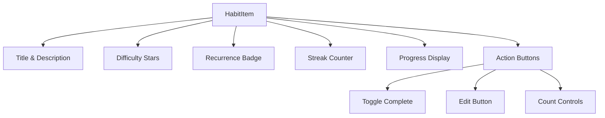
```mermaid
graph TD
    A[HabitItem] --> B[Title & Description]
    A --> C[Difficulty Stars]
    A --> D[Recurrence Badge]
    A --> E[Streak Counter]
    A --> F[Progress Display]
    A --> G[Action Buttons]
    
    G --> H[Toggle Complete]
    G --> I[Edit Button]
    G --> J[Count Controls]
```

#### TaskItem
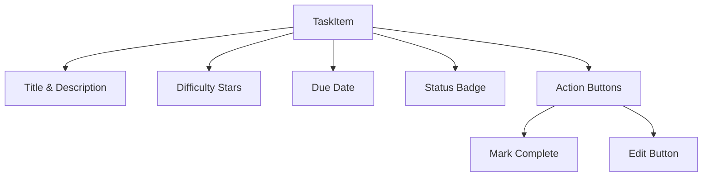
```mermaid
graph TD
    A[TaskItem] --> B[Title & Description]
    A --> C[Difficulty Stars]
    A --> D[Due Date]
    A --> E[Status Badge]
    A --> F[Action Buttons]
    
    F --> G[Mark Complete]
    F --> H[Edit Button]
```

#### ProjectItem
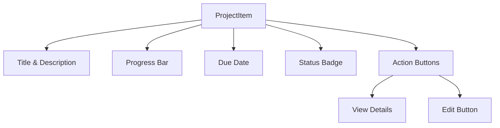
```mermaid
graph TD
    A[ProjectItem] --> B[Title & Description]
    A --> C[Progress Bar]
    A --> D[Due Date]
    A --> E[Status Badge]
    A --> F[Action Buttons]
    
    F --> G[View Details]
    F --> H[Edit Button]
```

### 3. Inventory System

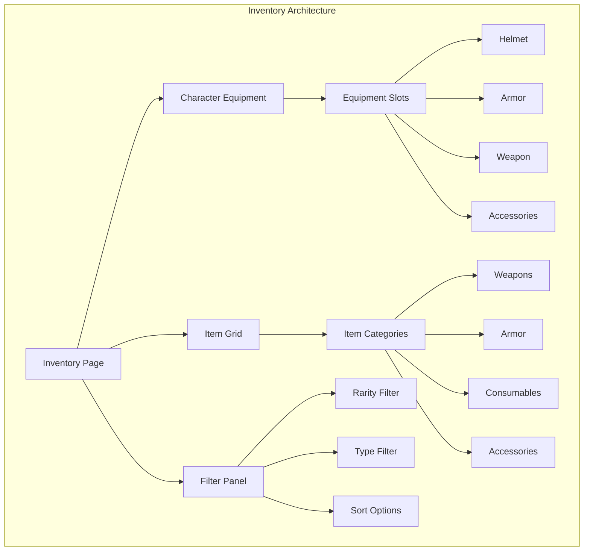
```mermaid
graph TB
    subgraph "Inventory Architecture"
        A[Inventory Page] --> B[Character Equipment]
        A --> C[Item Grid]
        A --> D[Filter Panel]
        
        B --> E[Equipment Slots]
        E --> F[Helmet]
        E --> G[Armor]
        E --> H[Weapon]
        E --> I[Accessories]
        
        C --> J[Item Categories]
        J --> K[Weapons]
        J --> L[Armor]
        J --> M[Consumables]
        J --> N[Accessories]
        
        D --> O[Rarity Filter]
        D --> P[Type Filter]
        D --> Q[Sort Options]
    end
```

### 4. Shop System

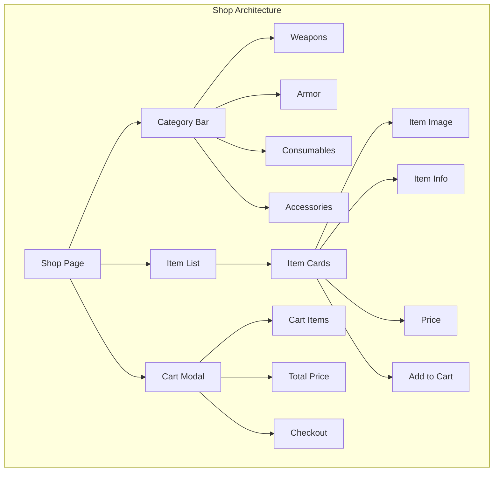
```mermaid
graph TB
    subgraph "Shop Architecture"
        A[Shop Page] --> B[Category Bar]
        A --> C[Item List]
        A --> D[Cart Modal]
        
        B --> E[Weapons]
        B --> F[Armor]
        B --> G[Consumables]
        B --> H[Accessories]
        
        C --> I[Item Cards]
        I --> J[Item Image]
        I --> K[Item Info]
        I --> L[Price]
        I --> M[Add to Cart]
        
        D --> N[Cart Items]
        D --> O[Total Price]
        D --> P[Checkout]
    end
```

## Modal System

### AddItemModal
A comprehensive modal for creating and editing items (habits, tasks, projects).

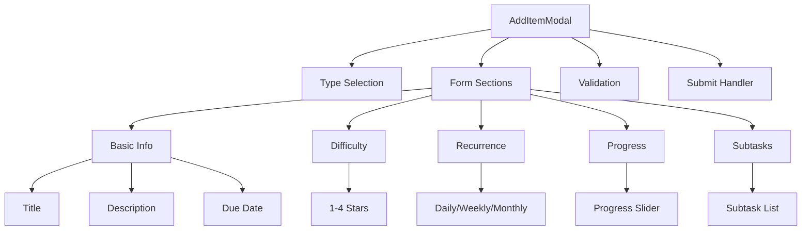
```mermaid
graph TD
    A[AddItemModal] --> B[Type Selection]
    A --> C[Form Sections]
    A --> D[Validation]
    A --> E[Submit Handler]
    
    C --> F[Basic Info]
    C --> G[Difficulty]
    C --> H[Recurrence]
    C --> I[Progress]
    C --> J[Subtasks]
    
    F --> K[Title]
    F --> L[Description]
    F --> M[Due Date]
    
    G --> N[1-4 Stars]
    H --> O[Daily/Weekly/Monthly]
    I --> P[Progress Slider]
    J --> Q[Subtask List]
```

### ProjectDetail Modal
Detailed view for project management with subtask handling.

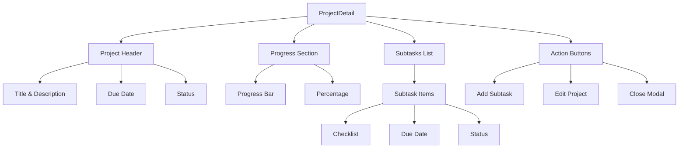
```mermaid
graph TD
    A[ProjectDetail] --> B[Project Header]
    A --> C[Progress Section]
    A --> D[Subtasks List]
    A --> E[Action Buttons]
    
    B --> F[Title & Description]
    B --> G[Due Date]
    B --> H[Status]
    
    C --> I[Progress Bar]
    C --> J[Percentage]
    
    D --> K[Subtask Items]
    K --> L[Checklist]
    K --> M[Due Date]
    K --> N[Status]
    
    E --> O[Add Subtask]
    E --> P[Edit Project]
    E --> Q[Close Modal]
```

## Styling System

### Theme Architecture

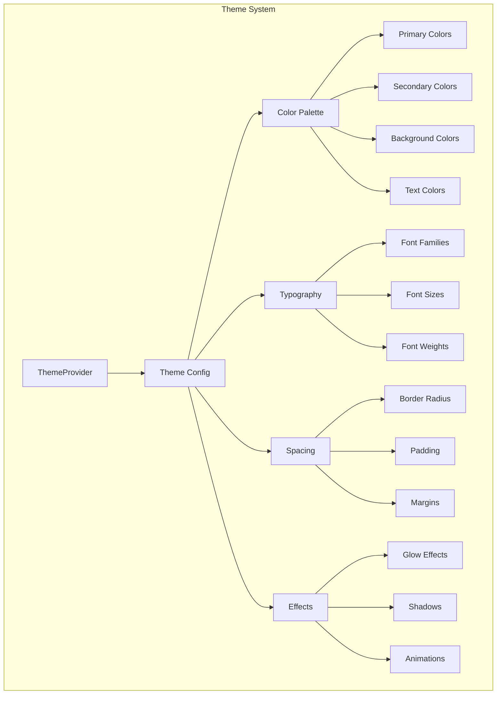
```mermaid
graph TB
    subgraph "Theme System"
        A[ThemeProvider] --> B[Theme Config]
        B --> C[Color Palette]
        B --> D[Typography]
        B --> E[Spacing]
        B --> F[Effects]
        
        C --> G[Primary Colors]
        C --> H[Secondary Colors]
        C --> I[Background Colors]
        C --> J[Text Colors]
        
        D --> K[Font Families]
        D --> L[Font Sizes]
        D --> M[Font Weights]
        
        E --> N[Border Radius]
        E --> O[Padding]
        E --> P[Margins]
        
        F --> Q[Glow Effects]
        F --> R[Shadows]
        F --> S[Animations]
    end
```

### Available Themes

1. **Light Theme**: Clean, minimal design
2. **Dark Theme**: Dark backgrounds with light text
3. **Neon Theme**: Cyberpunk-inspired with glow effects
4. **Cyberpunk Theme**: Futuristic design with sharp corners

## Data Flow

### Authentication Flow

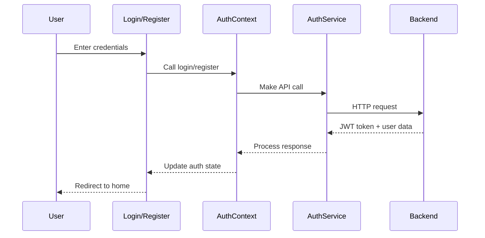
```mermaid
sequenceDiagram
    participant U as User
    participant L as Login/Register
    participant A as AuthContext
    participant S as AuthService
    participant B as Backend
    
    U->>L: Enter credentials
    L->>A: Call login/register
    A->>S: Make API call
    S->>B: HTTP request
    B-->>S: JWT token + user data
    S-->>A: Process response
    A-->>L: Update auth state
    L-->>U: Redirect to home
```

### Item Management Flow

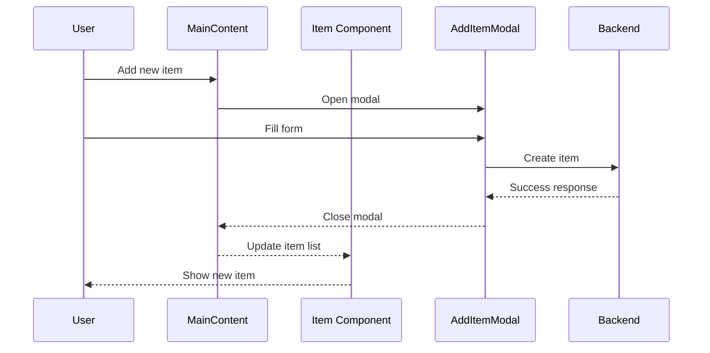
```mermaid
sequenceDiagram
    participant U as User
    participant M as MainContent
    participant I as Item Component
    participant A as AddItemModal
    participant B as Backend
    
    U->>M: Add new item
    M->>A: Open modal
    U->>A: Fill form
    A->>B: Create item
    B-->>A: Success response
    A-->>M: Close modal
    M-->>I: Update item list
    I-->>U: Show new item
```

### Drag and Drop Flow

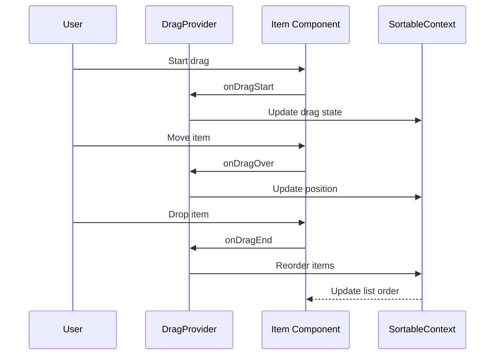
```mermaid
sequenceDiagram
    participant U as User
    participant D as DragProvider
    participant I as Item Component
    participant S as SortableContext
    
    U->>I: Start drag
    I->>D: onDragStart
    D->>S: Update drag state
    U->>I: Move item
    I->>D: onDragOver
    D->>S: Update position
    U->>I: Drop item
    I->>D: onDragEnd
    D->>S: Reorder items
    S-->>I: Update list order
```

## API Integration

### Service Layer

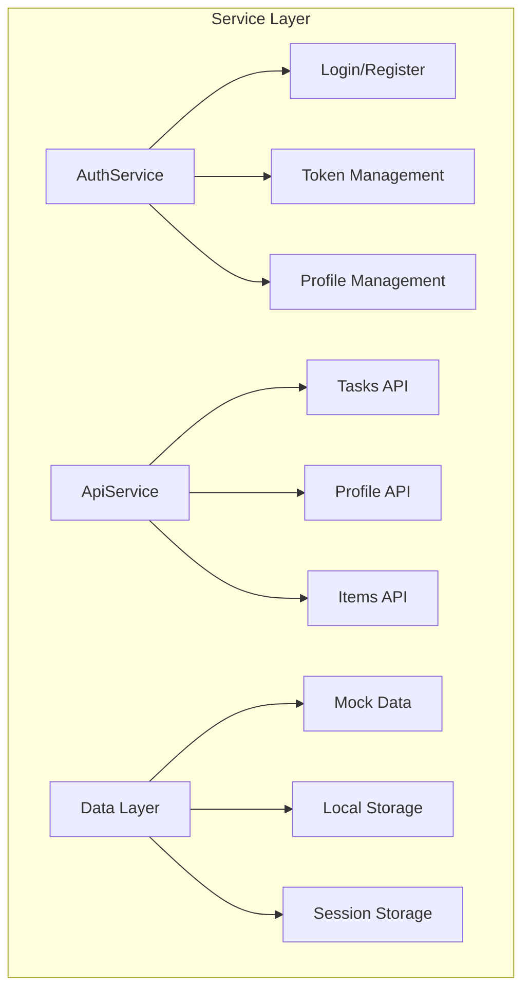
```mermaid
graph TB
    subgraph "Service Layer"
        A[AuthService] --> B[Login/Register]
        A --> C[Token Management]
        A --> D[Profile Management]
        
        E[ApiService] --> F[Tasks API]
        E --> G[Profile API]
        E --> H[Items API]
        
        I[Data Layer] --> J[Mock Data]
        I --> K[Local Storage]
        I --> L[Session Storage]
    end
```

### API Endpoints

- `POST /api/auth/register` - User registration
- `POST /api/auth/login` - User login
- `GET /api/profile` - Get user profile
- `GET /api/tasks` - Get user tasks
- `POST /api/tasks` - Create new task
- `PUT /api/tasks/:id` - Update task
- `DELETE /api/tasks/:id` - Delete task

## State Management

### Context Providers Hierarchy

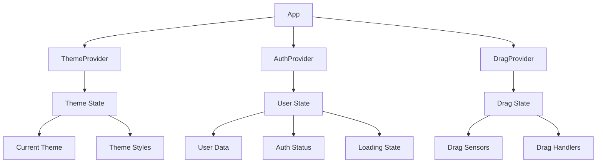
```mermaid
graph TD
    A[App] --> B[ThemeProvider]
    A --> C[AuthProvider]
    A --> D[DragProvider]
    
    B --> E[Theme State]
    C --> F[User State]
    D --> G[Drag State]
    
    E --> H[Current Theme]
    E --> I[Theme Styles]
    
    F --> J[User Data]
    F --> K[Auth Status]
    F --> L[Loading State]
    
    G --> M[Drag Sensors]
    G --> N[Drag Handlers]
```

## Development Guidelines

### Component Structure
```javascript
// Standard component structure
const ComponentName = ({ prop1, prop2, onAction }) => {
  // 1. Hooks and state
  const { theme } = useThemeStyles();
  const [state, setState] = useState();
  
  // 2. Event handlers
  const handleAction = () => {
    // Handle action
  };
  
  // 3. Render
  return (
    <div style={theme.styles}>
      {/* Component content */}
    </div>
  );
};
```

### Styling Guidelines
- Use theme-aware styling with `useThemeStyles()`
- Prefer inline styles for dynamic theming
- Use Tailwind classes for static styling
- Follow the established color palette
- Maintain consistency across themes

### Best Practices
1. **Component Composition**: Build complex UIs from simple, reusable components
2. **Theme Integration**: Always use theme-aware styling
3. **Error Handling**: Implement proper error boundaries and user feedback
4. **Performance**: Use React.memo for expensive components
5. **Accessibility**: Include proper ARIA labels and keyboard navigation
6. **Type Safety**: Use PropTypes or TypeScript for prop validation

## File Organization

### Component Naming Convention
- **Pages**: PascalCase (e.g., `Home.jsx`, `Inventory.jsx`)
- **Components**: PascalCase (e.g., `HabitItem.jsx`, `TaskItem.jsx`)
- **Utilities**: camelCase (e.g., `itemUtils.js`, `themeUtils.js`)
- **Services**: camelCase (e.g., `authService.js`, `apiService.js`)

### Import Organization
```javascript
// 1. React and external libraries
import React, { useState, useEffect } from 'react';
import { motion } from 'framer-motion';

// 2. Internal components
import { useThemeStyles } from '../context/ThemeProvider';
import HabitItem from './HabitItem';

// 3. Utilities and services
import { formatDate } from '../utils/dateUtils';
import authService from '../services/authService';
```

## Testing Strategy

### Component Testing
- Unit tests for individual components
- Integration tests for component interactions
- Theme switching tests
- Drag and drop functionality tests

### User Flow Testing
- Authentication flow
- Item creation and management
- Inventory management
- Shop functionality

## Performance Considerations

### Optimization Techniques
1. **Code Splitting**: Lazy load page components
2. **Memoization**: Use React.memo for expensive components
3. **Virtual Scrolling**: For large item lists
4. **Image Optimization**: Lazy load images
5. **Bundle Analysis**: Regular bundle size monitoring

### Monitoring
- Bundle size tracking
- Performance metrics
- Error tracking
- User analytics

## Deployment

### Build Process
```bash
# Development
npm run dev

# Production build
npm run build

# Preview production build
npm run preview
```

### Environment Configuration
- Development: `http://localhost:5173`
- Production: Configured via environment variables
- API endpoints: Configurable via service layer

## Future Enhancements

### Planned Features
1. **Real-time Updates**: WebSocket integration
2. **Offline Support**: Service worker implementation
3. **Mobile App**: React Native version
4. **Advanced Analytics**: User behavior tracking
5. **Social Features**: User collaboration
6. **AI Integration**: Smart task suggestions

### Technical Debt
1. **TypeScript Migration**: Gradual migration from JavaScript
2. **State Management**: Consider Redux for complex state
3. **Testing Coverage**: Increase test coverage
4. **Documentation**: API documentation
5. **Performance**: Bundle optimization

---

This documentation provides a comprehensive overview of the PlayerOne frontend architecture. For specific implementation details, refer to the individual component files and their inline documentation.
